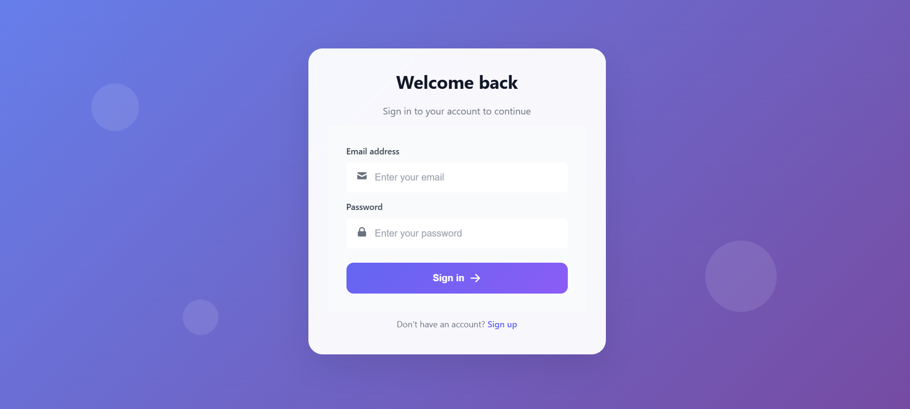

# Password Manager App

Welcome to the **Password Manager App**! This cutting-edge application securely stores and manages your passwords, usernames, and autofill options for various applications. With robust user authentication and advanced encryption techniques, your sensitive information is fully protected. This app ensures that you never forget a password again while keeping your data secure.

## 🚀 Features

- **User Authentication**: Safe login and registration system with email/password-based authentication.
- **Secure Storage**: Encrypts user data, ensuring all usernames, passwords, and autofill information are kept confidential.
- **Autofill Functionality**: Automatically fills in usernames and passwords for various apps and websites, improving convenience.
- **Encryption**: State-of-the-art AES-256 encryption ensures that your credentials are always protected, even in the event of a data breach.
- **Multi-Platform**: Fully responsive web app accessible across all devices.
- **User-Friendly Interface**: Modern and clean UI, making password management simple and intuitive.
- **Zero Knowledge Architecture**: We don’t store any plain-text passwords—your data is encrypted, and only you have the decryption key.

## 📦 Installation

Clone this repository to your local machine to get started.

```bash
git clone https://github.com/KKanistan06/Password-Manager.git
cd Password-Manager
```

### Prerequisites

- Node.js (v12 or later)
- npm (Node Package Manager)

### Setup

1. Install dependencies:
   ```bash
   npm install
   ```

2. Set up environment variables:
   - Create a `.env` file in the root directory of the project.
   - Add your environment variables (e.g., database connection URL, JWT secret, etc.) to this file.

3. Run the app:
   ```bash
   npm start
   ```

Your password manager app should now be running on `http://localhost:3000`.

## 🔐 Security

We prioritize security, and our app includes the following features to keep your data safe:

- **Password Encryption**: All passwords are encrypted using **AES-256**.
- **Salted Hashing**: User passwords are hashed with a salt before being stored.
- **Secure Login Flow**: Using secure sessions and JWT for authentication.
- **Two-Factor Authentication (TFA)** (Optional): Enable 2FA for an added layer of security during login.
- **Zero Trust**: The application has been designed with a "Zero Trust" approach, meaning no one has access to your data except you.

## 💡 How It Works

1. **Sign Up / Log In**:
   - New users create an account using their email and a secure password.
   - Returning users can log in using their credentials, which are validated against the encrypted database.

2. **Add Application Credentials**:
   - You can securely add usernames and passwords for any app or website.
   - The app automatically encrypts and stores these credentials in a secure database.

3. **Autofill and Auto-Login**:
   - With just a click, the app fills in your username and password into login forms for supported sites and applications.

4. **Secure Access**:
   - All sensitive data is encrypted with a private key that only you can access.
   - Your credentials are never stored in plain text.

## 🛠 Technologies Used

- **Frontend**: React.js, HTML5, CSS3, Bootstrap
- **Backend**: Node.js, Express.js
- **Database**: MongoDB (for storing encrypted credentials)
- **Encryption**: AES-256 (for secure password storage)
- **Authentication**: JSON Web Tokens (JWT) for user authentication
- **Libraries/Tools**: bcrypt.js (for password hashing), dotenv (for managing environment variables)

## 📱 Screenshots


*Login Page*


*Password Manager Dashboard*

## 💬 Contributing

We welcome contributions to this project! Whether it’s a bug fix, new feature, or even an idea, feel free to open an issue or submit a pull request. Please adhere to the following guidelines:

- Fork the repository and create your branch.
- Work on your changes, commit, and push to your fork.
- Create a pull request with a description of your changes.

## 📝 License

This project is licensed under the MIT License - see the [LICENSE](LICENSE) file for details.

## 🙏 Acknowledgements

- Thanks to all contributors for their hard work and support.
- Encryption algorithms powered by **AES-256**.
- Special thanks to the open-source community for their libraries and resources.

---

**Stay Secure. Stay Safe.**
